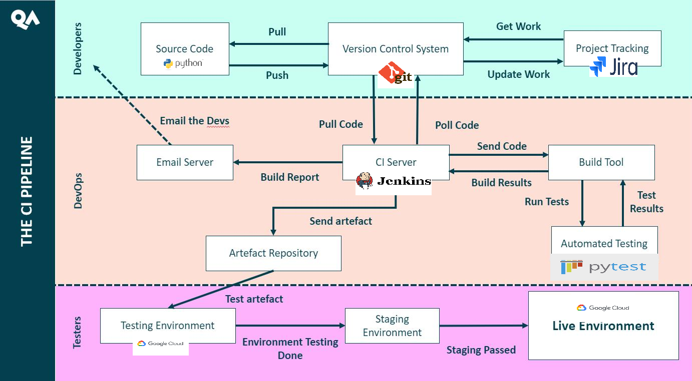
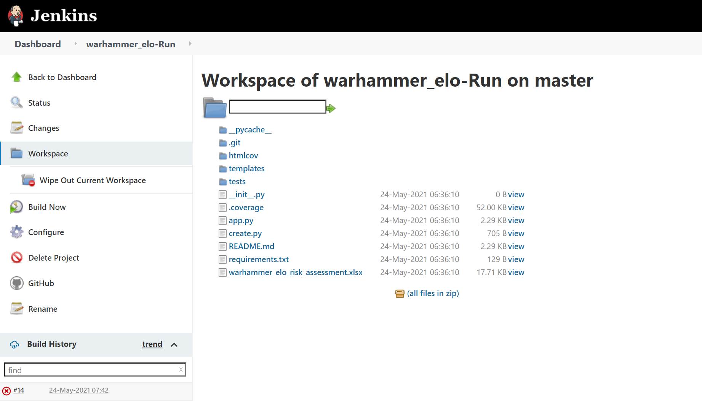

### ELO calculator (for warhammer)

 Inspired by this site - http://aligulac.com/
This is very extensive but I would like to build from the ground up a similiar platform but for competitive tabletop gaming.

I was tasked with making a CRUD application on the web using various tools and technologies to implement it. 

The overall idea of the app is to:

* Table of players ranked by rating created
* Allow players to be added or removed from the table
* Allow rating to be reset

Further down the line as my own project there will be:

* Predictive result based on rating
* Record of wins and loses by alliance
* A more robust ELO calculation based on a very scary math equation
* API to pull from a table of results posted online

### Design

## Database 

Entity relation diagram(ERD) showing the structure of the database. The table with a red outline was not implemented into the app yet.

The Games table providing a one to many relationship with players. One game type can account for many players using that system for their games.

### CI pipeline

Pictured below is the continuous integration pipeline. While the live project connects to the SQL server on GCP it does not however build from the jenkins server just yet. The intetntion being that code can be produced on a local code and pushed to github. In turn automatically pushing to the jenkins server where testing and reports would be done automatically.

Allowing for only stable versions of the app to be pushed to deployment.

Jenkins in the flesh, however it is broken currently.

### Project Tracking

Jira and a kanban board were used to track the progress. The board was designed to delegate smaller tasks and in a step by step build up to a functional app. These were also organised via the type of task like debug etc.

Above is an early snapshot of the progress.

### Risk

A quick screenshot, initially I had everything but the traffic monitoring. Upon reviewing the example report I then realised it was also a risk given the use of HTTP. It should be noted that at this point in the app no sensitive information is required.

### Testing

As can be seen the coverage is quite poor. Time constraints and last minute fixes to some functions. Integration testing was not done as I could not get the systems in place to run nevermind testing.

### Front End

A snippet of the front end user page that sorts the player by rating to give a dummy rankings page.

Please excuse my use of dark mode!

### Known issues

Going forward : 

* extensive testing done throught the app
* Jenkins building and integration testing done
* Currently can only reset player ELO if you know their ID.

### The Future

As this is a hobby project beyond QA training these things would be implemented:

* Predictive match results
* Players win and lose records
* Sort by best in Alliance
* Update player ELO by a value based on the ELO calculation for win/lose
* API to pull from a website containing all the matches played at an event - cuts down on manual data entry.

### Brought to you by Shane